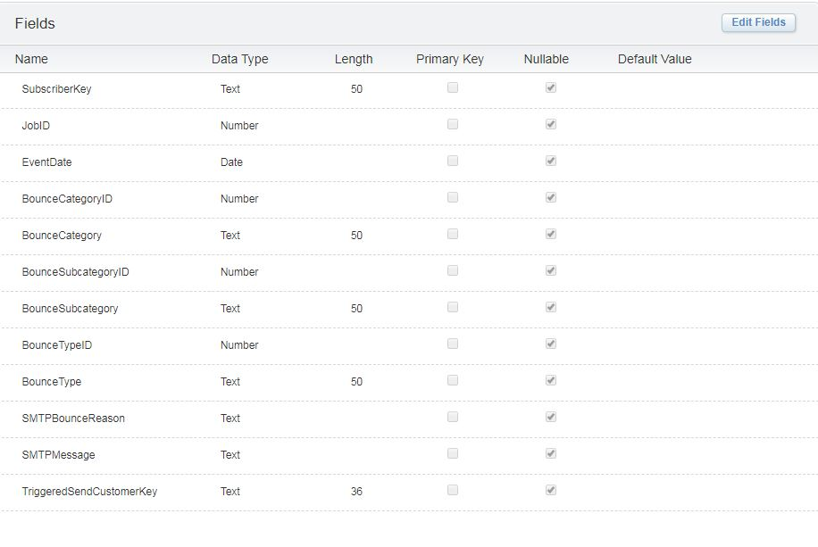
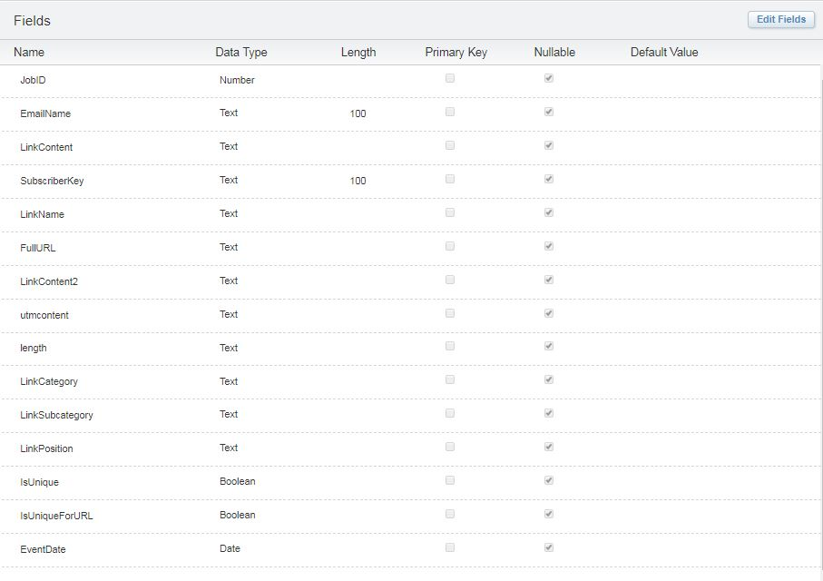
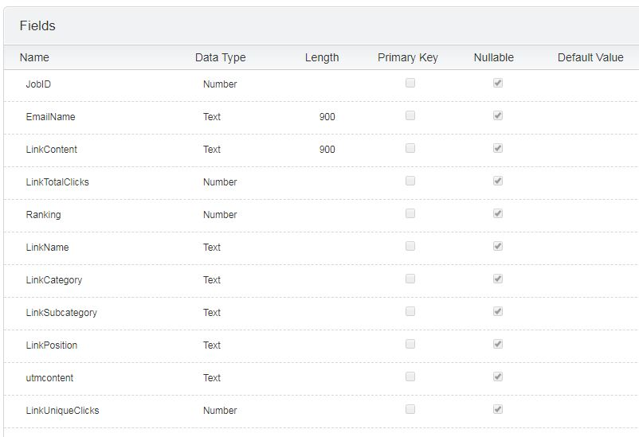

# Marketing-Cloud-Content-Reporting
A handful of queries and link tagging approach that will allow you to track content in Salesforce Marketing Cloud
Run these in order in Automation Studio with a series of Data Extensions to end up with a final content report with categories and subcategories.

**01 Newsletter Opens Past Month.sql** is an overwrite query to a table with this structure

**02 Newsletter Sends Past Month.sql** is an update query to the table above

**04 Newsletter Bounces Past Month.sql** is an update query to the table above

**05 Newsletter Clicks Past Month.sql** is an update query to the table above

**06 Newsletter Unsubscribes Past Month.sql** is an update query to the table above

**09 Get Market** an update query to the table above

## Content Bounces Table
We need this to pull all bounces for the past month so we can subtract them from Sent to get Delivered. It's basically just the _bounce data view.

**03 Bounces Past Month.sql** is an overwrite for the table below.

## Newsletter Link Clicks from the past month
This is basically just the _click data view. we use it as an in between table to grab all of our clicks so we can count them later. 
The query also splits out the url varaibles into columns.  
**07 Newsletter Links Clicked Past month.sql** is an overwrite for the table below

## Count up all the total and unique clicks from the past month
**08 Newsletter Click Totals Past Month** is an overwrite for the table below

## Content Report
The image below shows the structure of the final table you will use for excel, tableau or whatever data processing application you use.

**09 Get Market.sql** Get the market if you have one or feel like it. This is another update on the Newsletter KPI Past Month
Finally, **10 Put It All Together.sql** Which gathers everything into the table below.

